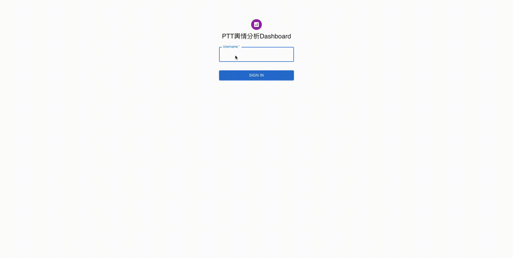

# Textdashboard - PTT monitoring dashboard

<div>
    <p align="center">
         
    </p>
<br>
<div>

## Introduction
This repo contains a dashboard which **user can monitor articles and trends on Internet.** Besides, this dashboard use **depp learning model to help user to automatically classify the articles into 7 categories.** Moreover, there are also web crawler that can **automatically crawl articles on the Internet.**
<br>
The current version takes the PTT Gossip  as an example. However, users can replace the web crawler by themselves to monitor the trend of a specific forum. :wink:

### Main features of this repo
1. Use React.js as frontend, Flask as backend, MongoDB as Database
2. Lots of graph to help user quickly cature the trend of the forum
3. Use Deep learning model to classify topic of articles(Use Pytorch)
4. Use web crawler to automatically crawl the articles, and use worldcloud to represent the result

<br>

## Main function
1. In main page, you can see the statistical information about your database, included **Pie Chart**, **Bar Chart** and so on
<div align="center">
     
</div>    
2. In Crawl page, after you press the button, **the backend will start to crawl articles on PTT**, then backend will apply **Deep learning model on each articles to classify article topic**, then it will show **Worldcloud** to the user
<div align="center">
     
     
</div>
3. In article page, you can see the latest articles in your database, **you can also click on the title to see the content in the article**
<div align="center">
     
     
</div>
<br>

## Prepare environment and MongoDB
There are two way to prepare for this repo, however, **USE DOCKER METHOD IS STRONGLY RECOMMENDED**

### Use Docker :whale:
Just pull image from docker hub
```
docker pull feng545035/textdashboard:1.0.0
```
### Manually :house:
Run the below script ( makesure you have python>=3.9.0 and yarn>=1.22.17 )
```
git clone https://github.com/chiluen/Textdashboard.git
cd ./Textdashboard
pip install -r requirement.txt
yarn install-all
yarn get-model
```
<br>

**Sometime "transformers" module in requirement.txt can't be well installed, then remove transformers from requirement.txt and run below script instead:
```
pip install git+https://github.com/huggingface/transformers
```
<br>
<font color=#FF6600>
    After finish setting environment for dashboard, you have to apply for a mongodb account(For free). You can follow this <a href="https://docs.mongodb.com/guides/server/drivers/">Link</a> , you will get a string like "mongodb+srv://Chiluen:..."
</font>

<br>

## Run the dashboard
For Docker: :whale: <br>
1. Open two terminal windows
2. Run below scripts on one of them **for frontend**
```
docker run -it --rm -p 3000:3000 feng545035/textdashboard:1.0.0 # for frontend
```
3. Run below scripts on other **for backend**
```
docker run -it --rm -p 5000:5000 feng545035/textdashboard:1.0.0 # for backend
```
4. In **backend window**, run the below scripts:
```
cd ./backend && cp .env.defaults .env
```
5. Fill the MONGO_URL in .env file with mongodb 
url( You can refer to Prepare environment section )
```
#In .env
MONGO_URL=“mongodb+srv://Chiluen:...”
```
6. Go to ```/Textdashboard``` in both frontend and backend
7. Type ```yarn frontend``` in frontend window; type ```yarn backend``` in backend window
8. After see "DB connected" in backend, then backend is on service, type ```http://localhost:3000``` in your browser, then you can use the dashboard!


### For manually :house:
1. Open two terminal windows, and go to ```/Textdashboard``` folder
2. In one window, run the below scripts:
```
cd ./backend && cp .env.defaults .env
```
3. Fill the MONGO_URL in .env file with mongodb 
url( You can refer to Prepare environment section )
```
#In .env
MONGO_URL=“mongodb+srv://Chiluen:...”
```
4. Go to ```/Textdashboard``` in both frontend and backend
5. Type ```yarn frontend``` in frontend window; type ```yarn backend``` in backend window
6. After see "DB connected" in backend, then backend is on service, type ```http://localhost:3000``` in your browser, then you can use the dashboard!

<br>

## Enjoy with this repo :kissing_heart:
Please feel free to connect me if you have any question about this repo, hope this repo can help someone~


